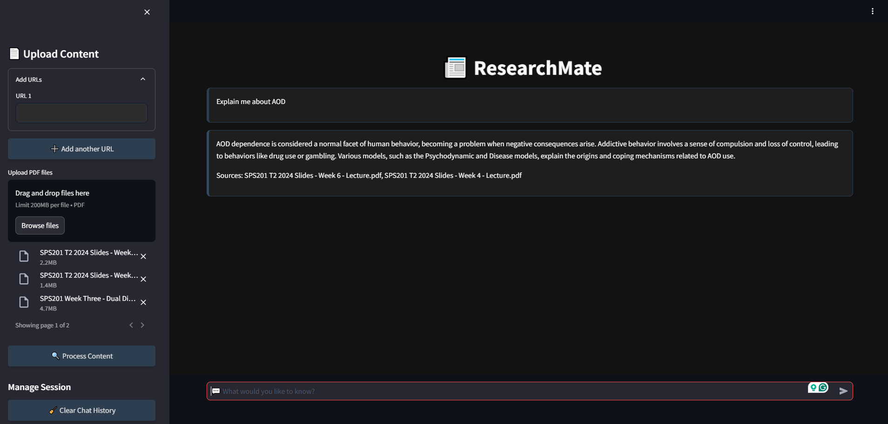

# ResearchMate: Your Ultimate Research Companion

ResearchMate is a versatile and user-friendly research tool designed to facilitate effortless information retrieval and analysis. Whether you're a student, researcher, or just curious, ResearchMate helps you find answers from provided URLs and uploaded PDF files. 




## Features

- **Dynamic Content Loading**: Upload URLs or PDF files to fetch and process content effortlessly.
- **Advanced Content Processing**: Utilize LangChain's UnstructuredURL Loader for URLs and PyMuPDF for PDFs.
- **Embedding Vector Construction**: Leverage OpenAI's embeddings and FAISS for swift and efficient retrieval of relevant information.
- **Interactive Q&A**: Ask questions and receive precise answers along with source references from the processed content.

## Installation

1.Clone this repository to your local machine using:

```bash
  git clone https://github.com/codebasics/langchain.git
```
2.Navigate to the project directory:

```bash
  cd equity_research_tool
```
3. Install the required dependencies using pip:

```bash
  pip install -r requirements.txt
```
4.Set up your OpenAI API key by creating a .env file in the project root and adding your API

```bash
  OPENAI_API_KEY=your_api_key_here
```
## Usage/Examples

1. Run the Streamlit app by executing:
```bash
streamlit run main.py

```

2.The web app will open in your browser.

- On the sidebar, you can input URLs directly.

- Initiate the data loading and processing by clicking "Process URLs."

- Observe the system as it performs text splitting, generates embedding vectors, and efficiently indexes them using FAISS.

- The embeddings will be stored and indexed using FAISS, enhancing retrieval speed.

- The FAISS index will be saved in a local file path in pickle format for future use.
- One can now ask a question and get the answer based on those news articles


### Example Use Case

Imagine you're a student researching automotive industry trends. You have several articles and reports in the form of URLs and PDFs. By using ResearchMate, you can:

1. Input the URLs and upload the PDFs.
2. Process the content and index it for efficient search.
3. Ask specific questions, like "What are the latest trends in the automotive industry?" or "What are the production forecasts for Tata Motors?"
4. Receive concise, context-based answers along with source references.

## Project Structure

- **main.py**: The main Streamlit application script.
- **requirements.txt**: A list of required Python packages for the project.
- **faiss_store_openai.pkl**: A pickle file to store the FAISS index.
- **.env**: Configuration file for storing your OpenAI API key.